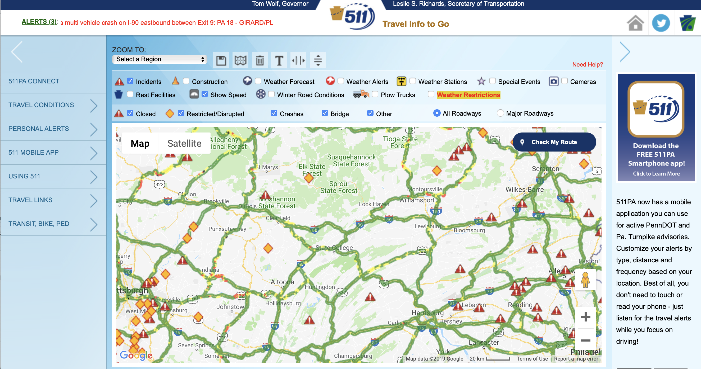

```{r setup, include=FALSE}
knitr::opts_chunk$set(echo = TRUE, cache = TRUE, fig.width = 10, fig.retina = TRUE, fig.asp = 0.618, fig.align = "center", message = FALSE)
```

# Extracting transportation safety data from online sources

## Crash-related data

### Historical data (yearly)
Historical crash-related variables such as location, time, weather, road surface conditions, vehicles/ pedestrians involved in a crash, crash outcomes and/or root-causes can be extracted from these two databases. 

- Federal Motor Carrier Safety Administration (FMCSA)|all truck crashes
- National Highway Traffic Safety Administration (NHTSA)|all fatal crashes

**FMCSA database**

The Motor Carrier Crash Information can be downloaded on Federal Motor Carrier Safety Administration ([FMCSA](https://ai.fmcsa.dot.gov/SMS/Tools/Downloads.aspx)). This database contains information about the location, vehicle and severity of truck crashes (description about each feature can be found [here](data/Crash_Readme.txt)). We downloaded the FMCSA Motor Carrier Crash data on January 15, 2019 and they were collected between December 2016 and December 2018. The Following table and graph show the truck crashes information in Missouri, 2017. 
```{r fig.width=6}
pacman::p_load(data.table, tidyverse, purrr, foreign, knitr, kableExtra, darksky)

fmcsa = data.table::fread("data/Crash_2018Dec/2018Dec_crash.txt")

fmcsa[, REPORT_DATE := lubridate::dmy(REPORT_DATE)]
fmcsa[, ymonth:= paste0(substr(REPORT_DATE, 1, 4), substr(REPORT_DATE, 6, 7))]
fmcsamo = fmcsa[REPORT_STATE == "MO"& year(REPORT_DATE) == 2017]

fmcsamo %>% 
  ggplot(aes(x = ymonth)) + geom_bar(fill = "lightblue") + 
  xlab("Year and month") + ylab("The number of motor carrier crashes") + 
  theme_bw() + theme(axis.text.x = element_text(angle = 45, hjust = 1))

knitr::kable(fmcsamo[1:5,], format = "html",
             caption = "All truck crashes in Missouri, 2017") %>% 
  kable_styling(bootstrap_options = c("condensed")) %>% 
  scroll_box(width = "100%", height = "300px")

cat("Number of Observations and Variables:",dim(fmcsa))
```
For the mentioned time period, there were `r dim(fmcsa)[1]` observations and `r dim(fmcsa)[2]` variables. Further, the original format of this database is text (.txt). For more convenience, one can convert the format of this database to comma-separated values(.csv).

```{r}
fwrite(fmcsa, "data/fmcsa.csv")
```


**NHTSA database**

All fatal crashes from 1975 to 2017 (FARS database) can be downloaded at National Highway Traffic Safety Administration (NHTSA) [official site](ftp://ftp.nhtsa.dot.gov/fars/). FARS dataset provides information about fatal crashes in three aspects: crashes, vehicles and people. The code chunk shows the different files that are accessible from this dataset. 

```{r}
require(data.table)

csvpath = './data/FARS2017NationalCSV/'
csvname = list.files(path = csvpath, pattern = "*.csv")
csvpathname = paste0(csvpath, csvname)

nhtsa = purrr::map(csvpathname, fread) %>% 
  set_names(gsub(".csv", "", csvname))

csvname
```

Besides, there is an exclusive database from 2000 to 2010, for trucks involved in fatal crashes (TIFA) which is built on FARS database and can be downloaded [here](http://www.cmisst.org/tools-resources/database-resources/dataset-collection/). FARS has provided data in csv format However, TIFA has published data in sas7bdat format. For more convienece, the provided code converts TIFA database to csv format files. 

```{r}
tifa2010 = haven::read_sas("data/TIFA_2010/TIFA_2010.sas7bdat")
fwrite(tifa2010, "data/TIFA_2010/tifa2010.csv")
```

```{r}
knitr::kable(tifa2010[1:5,], format = "html",
             caption = "Fatal truck crashes provided by the TIFA, 2010") %>% 
  kable_styling(bootstrap_options = c("condensed")) %>% 
  scroll_box(width = "100%", height = "300px")
```


### Real-time data (<= 1 hour)

Most of the states in the USA have activated 511 system. Basically, this system provides real-time travel information such as traffic, road and weather conditions. Currently this system provides accident/incident cases in a visual format. The following figure displays a screenshot of [Pennsylvania 511](https://www.511pa.com/website).




## Traffic flow data
### Historical data (yearly)
[FHWA](https://www.fhwa.dot.gov/policyinformation/hpms/shapefiles.cfm) has provided Annual Average Daily Traffic (AADT) from 2011 to 2017. As an illustration, the following code chunk displays the first five observations of AADT data for Missouri 2017.

```{r FHWA}
# Using Missouri as an example
fhwai = foreign::read.dbf("data/missouri2017/Missouri2017.dbf")

knitr::kable(fhwai[1:5,], format = "html",
             caption = "Historical traffic data in Missouri, 2017") %>% 
  kable_styling(bootstrap_options = c("condensed")) %>% 
  scroll_box(width = "100%", height = "300px")
```


The downloaded “shape files” can be converted to different data formats (e.g., .csv) using the following R code.
```{r}
fwrite(fhwai, "data/missouri2017/fhwai.csv")
```

### Real-time data (<= 5 minutes)

There are several sources for getting real-time traffic data. Some of the states in the USA are equipped with loop detectors and video cameras. Departments of Transportation (DoT) can provide this data. Further, HERE website also provides near real-time traffic data with the limitation of x APIs per day for free. Later, a detailed instruction for getting this data form HERE website is provided. 

- State DoTs|loop detector
- State DoTs|video frames

**HERE Website**

[HERE|Phone based](https://developer.here.com/documentation/traffic/topics_v6.1/flow.html)


## Weather data

### Historical (daily)

[NOAA](https://www.ncdc.noaa.gov/)

### Real-time (<= 1 hour)

In this part, we show how to get both historical and real-time weather data using [DarkSky API](https://darksky.net/dev/docs/libraries). It can be used in both [Python](https://github.com/bitpixdigital/forecastiopy3) and [R](https://github.com/hrbrmstr/darksky). Before using the DarkSky API to get weather data, you need to register for a API key on [its official website](https://darksky.net/dev/register). The first 1000 API requests you make each day are free, but each API request over the 1000 daily limit will cost you $0.0001, which means a million extra API requests will cost you 100 USD. 

To get weather data from the DarkSky API, you need to provide the following information on trucks:

1. latitude
2. longitude
3. date and time

Then you can pass these three parameters to the `get_forecast_for()` function in [`darksky`](https://github.com/hrbrmstr/darksky) package in R.

```{r}
source("private/DarkSkyAPIkey.R")
Sys.setenv(DARKSKY_API_KEY = myDarkSkyAPIkey) # you need to use your own "myDarkSkyAPIkey"

dat = structure(list(
  latitude = c(41.3473127, 41.8189037, 32.8258477, 40.6776808, 40.2366043), 
  longitude = c(-74.2850908, -73.0835104, -97.0306677, -75.1450753, -76.9367494), 
  time = structure(c(1453101738, 1437508088, 1436195038, 1435243088, 1454270680), 
  class = c("POSIXct", "POSIXt"), tzone = "UTC")), 
  row.names = c(NA, -5L), class = "data.frame"
)

weather_dat <- pmap(
   list(dat$latitude, dat$longitude, dat$time),
   get_forecast_for)
```

## DarkSky returned data {.tabset .tabset-fade}

For each datum,  data returned by the darksky API includes a list of 3 data.frames: 

1. hourly weather data. 24 hourly observations for each 15 weather variables in that day.
2. daily weather data. 1 observations for each 34 weather variables in that day.
3. current weather data. 1 observations for each 15 weather variables at the assigned time point.

The variables include: apparent (feels-like) temperature, atmospheric pressure, dew point, humidity, liquid precipitation rate, moon phase, nearest storm distance, nearest storm direction, ozone, precipitation type, snowfall, sun rise/set, temperature, text summaries, uv index, wind gust, wind speed, wind direction 

### hourly weather

```{r}
kable(weather_dat[[1]]$hourly) %>% 
  kable_styling(full_width = F) %>% 
  column_spec(1, width = "20em") %>% 
  scroll_box(height = "300px") #width = "100%", 
```

### daily weather

```{r}
kable(weather_dat[[1]]$daily) %>% 
  kable_styling(bootstrap_options = c("condensed")) %>% 
  scroll_box(height = "200px") 
```

### currently weather

```{r}
kable(weather_dat[[1]]$currently) %>% 
  kable_styling(bootstrap_options = c("condensed")) %>% 
  scroll_box(height = "100px") 
```


# Descriptive analytic tools used for understanding transportation safety data

## An example of clustering

The following codes attempts to replicate the visual clustering approach from

> Van Wijk, Jarke J., and Edward R. Van Selow. 1999. "Cluster and Calendar Based Visualization of Time Series Data." In Information Visualization, 1999.(Info Vis' 99) Proceedings. 1999 IEEE Symposium on, 4-9. IEEE.

A brief example of applying EDA methods on traffic data is provided here. The goal of this example is to illustrate the efficiency of the mentioned tools in the transportation context. There is no predetermined way to utilize these methods. The efficiency of each method highly depends on the nature of the problem. Hence, the challenge is to choose the right tool which fits the best.

### Collecting Data
Hourly vehicle counts data is used in this example. It provides the number of vehicles which passed along a particular segment of a road in one hour. Data is extracted from the Georgia Department of Transportation (GDoT) (Georgia Department of Transportation, 2015) for 2015 from station 121-5505 which located in Atlanta. GDoT provides data in separate sheets for each month. After extracting and cleaning data, it was combined to one sheet with 365 rows (days) and 24 columns (hours). Data can be downloaded from [GDoT](http://geocounts.com/gdot/).

###Clustering
It is almost impossible to understand raw data and also discover interesting patterns in it by just looking at 8760 (370 * 24) data cells. Hence, K-means clustering method is utilized here to present data in a more understandable format. K-means clustering is a common technique to explore data and discover patterns by grouping similar data to predefined (k) number of clusters. K-means clustering aims to group data into k clusters in a way to minimize the within-cluster sum of squares (WCSS). To find the optimal number of clusters, we have used a method that was suggested  by [Pham et al. (2005)](https://journals.sagepub.com/doi/abs/10.1243/095440605X8298?casa_token=Dxd8Ny3CIVwAAAAA%3ARo-nbplezRozrmMehzua_ZbbbTp7O9xFPXFGu0JULHsZwDzjSJNkMiY73-_mTMKbWE2ntgOkzzE). According to the following graph two is the best number of clusters to group this data.

```{r}
pacman::p_load(data.table,devtools,
       ggplot2,plotly,extrafont,grDevices,RColorBrewer, ggthemes,
       dplyr, stringr,tidyverse,readr,
       rstudioapi,processx,
       ClusterR)

# install_github("jayjacobs/ggcal")
library(ggcal)

trafficflow.df <- read_csv("data/georgia-TFdata-station-121-5505-Yr2015.csv")
trafficflow.df$Date <- as.Date(trafficflow.df$Date, format='%d-%b')

opt = Optimal_Clusters_KMeans(
  as.data.frame(trafficflow.df[,4:27]), max_clusters = 10, 
  plot_clusters = T, criterion = 'distortion_fK', fK_threshold = 0.85,
  initializer = 'optimal_init', tol_optimal_init = 0.2,
  max_iters = 10000)
num_clusters <- which.min(opt) # Based on the results, we should use k=2 clusters in kmeans
km = KMeans_arma(as.data.frame(trafficflow.df[,4:27]), clusters = num_clusters, n_iter = 10000, seed_mode = "random_subset", 
                 verbose = T, CENTROIDS = NULL)
pr = predict_KMeans(data.frame(trafficflow.df[,4:27]), km)
trafficflow.df$cluster.num <- as.vector(pr) %>% as.factor()
table(trafficflow.df$cluster.num)
```


### Visualization
Now, k-means clustering can be applied. The output of this step is a column which its value is either one or two,indicating that each row of data (day) belongs to cluster one or two. Now data is divided into two groups. However, still we need to transfer data to a visual format to somehow validate and guide the clustering process. Since our data contains temporal information, we have used Cluster Calendar View visualization technique which is introduced by [Van Wijk and Van Selow (1999)](https://ieeexplore.ieee.org/abstract/document/801851). In this technique, a calendar represents the temporal information of data and by using color coding, differences between clusters are distinguished. The following graph shows a cluster calendar view for our data. It clearly has found meaningful patterns in the vehicle counts data. Weekends and weekdays have different traffic patterns. Besides, it has captured some of the holidays. For example, the 4th of July (Independence Day) which is a weekday, is colored by light blue. It means that this day has a similar traffic pattern with weekends. In addition, the clustering method has identified other holidays like Martin Luther King Day, Memorial Day, Labor Day, Thanksgiving Day and Christmas Day.

```{r}
col.brewer.pal <- brewer.pal(11, "Paired")
p2 <- ggcal(trafficflow.df$Date,trafficflow.df$cluster.num) + 
  theme(legend.position="top") +
  scale_fill_manual(values = c("1"=col.brewer.pal[1], "2"=col.brewer.pal[2]))
p2
```

Furthermore, a line chart (following graph) is used to show the average hourly traffic data for the two clusters. Results show that each cluster has different peaks and valleys. On the weekdays, 7 AM and 4 PM have the greatest number of vehicles which can be explained by the official working hours. On the other hand, on weekends, the traffic peak is around 1 PM which maybe refers to some people going out for lunch.
```{r}
summary.df <- group_by(trafficflow.df,cluster.num)
summary.df <- summarise_all(summary.df,funs(mean))
plot.df <- subset(summary.df, select = -c(2:4))
plot.df <- melt(plot.df, value.name="Traffic.Flow",
                        variable.name="Hour",id.vars="cluster.num")
plot.df$cluster.num <- as.factor(plot.df$cluster.num)

p1 <- ggplot(data = plot.df, aes(x = Hour, y = Traffic.Flow, group=cluster.num,
                           color=cluster.num)) + geom_line(size=2) +
  theme_bw() + 
  theme(legend.position="top", axis.text.x=element_text(angle=90, hjust=1)) +
  scale_color_brewer("Paired")
p1
```

To sum up, it seems that K-means clustering method was very efficient here. We applied raw data as inputs to this method and as outputs we could discover patterns (weekdays and weekends traffic patterns) and also with the help of visualization technique we obtained a considerable information about the data.


