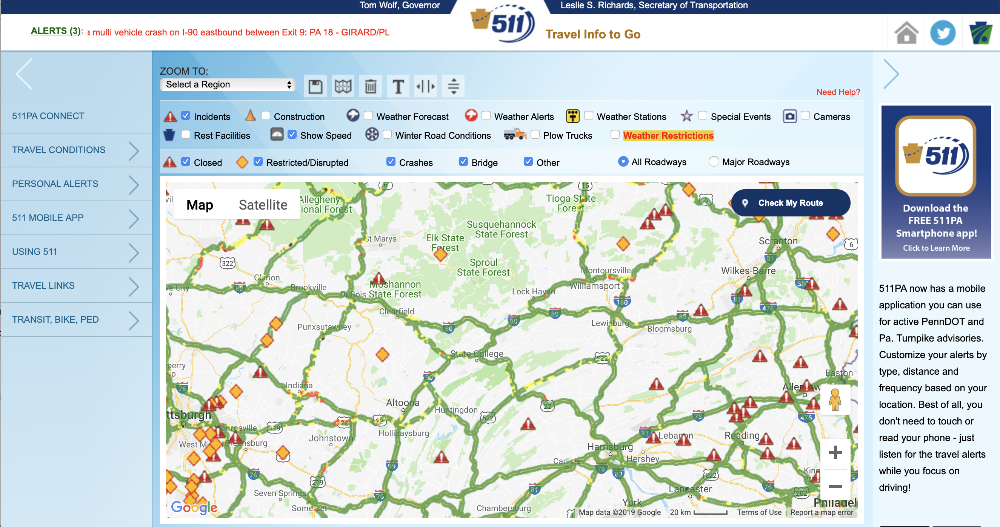

<style type="text/css">

body{ /* Normal  */
      font-size: 16px;
  }
td {  /* Table  */
  font-size: 12px;
}
h1.title {
  font-size: 35px;
}
h1 { /* Header 1 */
  font-size: 20px;
  margin: 10px;
  padding: 0;
}
h2 { /* Header 2 */
    font-size: 16px;
    margin: 10px;
    padding: 0;
}
h3 { /* Header 4 */
  margin: 10px;
  padding: 0;
}
h4 { /* Header 3 */
  font-size: 16px;
  margin: 10p;
  padding: 0;
}
code.r{ /* Code block */
    font-size: 14px;
}
pre { /* Code block - determines code spacing between lines */
    font-size: 14px;
}
</style>

```{r setup, include=FALSE}
knitr::opts_chunk$set(
  echo = TRUE, cache = TRUE, message = FALSE,
  fig.width = 8, fig.asp = 0.618, fig.align = "center")

#devtools::install_github("jayjacobs/ggcal")
pacman::p_load(
  data.table, tidyverse, foreign, darksky, DT, 
  ClusterR, RColorBrewer, rmdformats, ggcal, gtools)
```

In this review paper, we attempt to provide a comprehensive review on transportation research and optimization models. This vignette serves as the supplementary materials to create reproducible examples in the manuscript **Bridging the Gap between Transportation Safety Research and its Incorporation inOptimization Models: a Detailed Review and Perspective**. Submitted to _[Transportation Research Part C: Emerging Technologies](https://www.journals.elsevier.com/transportation-research-part-c-emerging-technologies)_. 

This vignette includes examples on the following five aspects:

1. **Bibliographic analysis**:  Bibliometric Summary for Transportation Safety, Bibliographic Network Matrices - Journal Names, keyword co-occurrences network, a Conceptual Structure Map
2. **Extracting online transportation safety data**: Crash-related data, traffic flow data, and weather data.
3. **Descriptive analytic tools**: data visualization and clustering
5. **An example of clustering**
5. **Statistical methods**: logistic regression and Poisson regression

To maximize the readability of this vignette, we hided all R codes by default, but readers can look into any code by clicking the `code` button.


Bibliographic analysis
======================
To perform a quick bibliometric analysis on [Clarivate Analytics Web of Science (WoS)](https://clarivate.com/products/web-of-science/), we searched transportation safety publications in WoS Core Collection using the following combination of words without limiting the document type, years, language:

```
("hazmat transportation" OR "real-time crash prediction" OR ("vehicle routing" AND safety))
```

This resulted in a downloadable plain .txt file (we named it 'savedrecs.text' under data folder), containing the full records with cited references for 992 results (conducted at 7/30/2018 - 11:08 am ET). We then used the R package [`bibliometrix`](http://www.bibliometrix.org/) to conduct a bibliometric analysis on this topic.

## Bibliometric Summary for Transportation Safety

```{r warning=FALSE}
pacman::p_load(bibliometrix,tidyverse,data.table,rvest) 

df.trans.safety <- readFiles("data/savedrecs.txt")
M <-convert2df(df.trans.safety)

# Bibliometric Analysis (Per the Bibliometrix Guide)
results <- biblioAnalysis(M, sep = ";")
# Options modified for this analysis purposes
options(width=100)
S <- capture.output(summary(object = results, k = 10, pause = FALSE))
cat("Bibliometric Summary for Transportation Safety",
    S,file = "biblio-summary.txt", sep = "\n")
plot(x = results, k = 10, pause = FALSE)
```


## Bibliographic Network Matrices - Journal Names

```{r}
NetMatrix <- biblioNetwork(M, analysis = "coupling", 
                           network = "sources", 
                           sep = ";")
net=networkPlot(NetMatrix,  normalize = "salton", 
                weighted=NULL, n = 25, 
                Title = "Coupling of Journal Names", 
                type = "auto", size=13,size.cex=T,
                remove.multiple=TRUE,labelsize=0.55,
                label.n=25,label.cex=F,
                cluster="optimal",edges.min = 5)
```

## keyword co-occurrences network

```{r}
NetMatrix <- biblioNetwork(
  M, analysis = "co-occurrences", network = "keywords", sep = ";")

net=networkPlot(
  NetMatrix, normalize="salton", weighted=NULL, n = 60,
  Title = "Keyword Co-Occurrences", type = "auto", 
  size=15, size.cex=T, remove.multiple=TRUE,labelsize=0.75,
  label.n=60,label.cex=F, cluster="optimal",edges.min = 5, 
  label.color = TRUE, halo = TRUE)
netstat <- networkStat(NetMatrix)
out <- capture.output(summary(netstat, k=60))
cat("Network Statistics",
    S,file = "keyword-network-statistics.txt", 
    sep = "\n")
```

## a Conceptual Structure Map

Creating a Conceptual Structure Map from the Titles Using the MCA Method with terms mentioned at least 25 times in the title

```{r}
CS <- conceptualStructure(
  M,field="ID_TM", method="MCA", minDegree=20, 
  k.max=5, labelsize=15, documents = 856)
```


Extracting online transportation safety data
============================================

This section provides sources for online open-access transportation data, including both historic and real-time crash-related, traffic flow, and weathaer data. We also provided R codes to read different formats of data and convert them to compatible comma separated value (.csv) files.

## Crash-related data
### Historical data (yearly)
Historical crash-related variables such as location, time, weather, road surface conditions, vehicles/ pedestrians involved in a crash, crash outcomes and/or root-causes can be extracted from these two databases. 

- Federal Motor Carrier Safety Administration (FMCSA)|all truck crashes
- National Highway Traffic Safety Administration (NHTSA)|all fatal crashes

**FMCSA database**

The Motor Carrier Crash Information can be downloaded on Federal Motor Carrier Safety Administration ([FMCSA](https://ai.fmcsa.dot.gov/SMS/Tools/Downloads.aspx)). This database contains information about the location, vehicle and severity of truck crashes (description about each feature can be found [here](data/Crash_Readme.txt)). We downloaded the FMCSA Motor Carrier Crash data on January 15, 2019 and they were collected between December 2016 and December 2018. The Following table and graph show the truck crashes information in Missouri, 2017. 

```{r fig.width=6,fig.cap='The number of motor carrier crashes by year and month in Missouri 2017',fig.align='center'}
fmcsa = data.table::fread("data/Crash_2018Dec/2018Dec_crash.txt")

fmcsa[, REPORT_DATE := lubridate::dmy(REPORT_DATE)]
fmcsa[, ymonth:= paste0(substr(REPORT_DATE, 1, 4), substr(REPORT_DATE, 6, 7))]
fmcsamo = fmcsa[REPORT_STATE == "MO"& year(REPORT_DATE) == 2017]

fmcsamo %>% 
  ggplot(aes(x = ymonth)) + geom_bar(fill = "lightblue") + 
  xlab("Year and month") + ylab("The number of motor carrier crashes") + 
  theme_bw() + theme(axis.text.x = element_text(angle = 45, hjust = 1))
```

```{r}
datatable(
  head(fmcsamo),
  caption = 'All truck crashes in Missouri, 2017',
  class = 'cell-border stripe', 
  extensions = c('Buttons', 'ColReorder'),
  options = list(
    dom = 'Bfrtip', colReorder = TRUE, scrollX = TRUE,
    buttons = c('copy', 'csv', 'excel', 'pdf', 'print')
  )) %>% 
  formatStyle( 0, target= 'row', lineHeight='50%')
```


For the mentioned time period, there were `r dim(fmcsa)[1]` observations and `r dim(fmcsa)[2]` variables in the data. Further, the original format of this database is text (.txt). For more convenience, one can convert the format of this database to comma-separated values(.csv).

```{r}
data.table::fwrite(fmcsa, "data/fmcsa.csv")
```


**NHTSA database**

All fatal crashes from 1975 to 2017 (FARS database) can be downloaded at National Highway Traffic Safety Administration (NHTSA) [official site](ftp://ftp.nhtsa.dot.gov/fars/). FARS dataset provides information about fatal crashes in three aspects: crashes, vehicles and people. The names of all available .csv files are listed below. 

```{r}
csvpath = './data/FARS2017NationalCSV/'
csvname = list.files(path = csvpath, pattern = "*.csv")
csvpathname = paste0(csvpath, csvname)

nhtsa = purrr::map(csvpathname, fread) %>% 
  set_names(gsub(".csv", "", csvname))

csvname
```

Besides, there is an exclusive database from 2000 to 2010, for trucks involved in fatal crashes (TIFA) which is built on FARS database and can be downloaded [here](http://www.cmisst.org/tools-resources/database-resources/dataset-collection/). FARS has provided data in csv format However, TIFA has published data in sas7bdat format. For more convienece, the provided code converts TIFA database to csv format files. 

```{r}
tifa2010 = haven::read_sas("data/TIFA_2010/TIFA_2010.sas7bdat")
data.table::fwrite(tifa2010, "data/TIFA_2010/tifa2010.csv")

datatable(
  head(tifa2010),
  caption = 'Fatal truck crashes provided by the TIFA, 2010',
  class = 'cell-border stripe', 
  extensions = c('Buttons', 'ColReorder'),
  options = list(
    scrollX = TRUE, dom = 'Bfrtip', colReorder = TRUE,
    buttons = c('copy', 'csv', 'excel', 'pdf', 'print')
  )) %>% 
  formatStyle( 0, target= 'row', lineHeight='50%')
```

### Real-time data (<= 1 hour)

Most of the states in the USA have activated 511 system. Basically, this system provides real-time travel information such as traffic, road and weather conditions. Currently this system provides accident/incident cases in a visual format. The following figure displays a screenshot of [Pennsylvania 511](https://www.511pa.com/website).




## Traffic flow data
### Historical data (yearly)
[FHWA](https://www.fhwa.dot.gov/policyinformation/hpms/shapefiles.cfm) has provided Annual Average Daily Traffic (AADT) from 2011 to 2017. As an illustration, the following code chunk displays the first five observations of AADT data for Missouri 2017.

```{r FHWA}
# Using Missouri as an example
fhwai = foreign::read.dbf("data/missouri2017/Missouri2017.dbf")

datatable(
  head(fhwai),
  caption = 'Historical traffic data in Missouri, 2017',
  class = 'cell-border stripe', 
  extensions = c('Buttons', 'ColReorder'),
  options = list(
    dom = 'Bfrtip', colReorder = TRUE, scrollX = TRUE,
    buttons = c('copy', 'csv', 'excel', 'pdf', 'print')
  ))
```


The downloaded “shape files” can be converted to different data formats (e.g., .csv) using the following R code.
```{r}
data.table::fwrite(fhwai, "data/missouri2017/fhwai.csv")
```

### Real-time data (<= 5 minutes)

There are several sources for getting real-time traffic data. Some of the states in the USA are equipped with loop detectors and video cameras. Departments of Transportation (DoT) can provide this data. 

Further, [HERE](https://www.here.com/) website also provides near real-time traffic data with the limitation of 250,000 APIs per month for free. The [HERE Traffic API ](https://developer.here.com/documentation/traffic/topics/what-is.html) provides traffic flow and incidents information. It also allows the users to request traffic map tiles. The HERE Traffic API provides four types of traffic data:

- Traffic Incident Data: the type and location of each traffic incident, status, start and end time, and other relevant data
- Traffic Map Tile Overlays (Traffic Tiles): pre-rendered map tile overlays with traffic information
- Traffic Flow Data: real-time traffic flow data, including speed, congestion, geometry of the road segments
- Traffic Flow Availability: traffic flow information, excluding incidents in an area

The HERE API do not provide a package/interface in R. Queries data from HERE API in R may need messy and highly customized code, so we do not provide R code here. 

```{r eval=FALSE}
pacman::p_load(XML, jsonlite, RCurl)

source("private/HEREAPIkey.R") # you need to register you own App_code and App_id

# set up example data
latitude <- 34.9859619
longitude <- -78.5900116
range <- 1800 # 30 minutes, in seconds
resolution <- 5

response_parsed <- RJSONIO::fromJSON(
  RCurl::getURL(paste0(
    "https://traffic.cit.api.here.com/traffic/6.2/flow/json/8/134/86&",
    "?app_id=", App_id, "&app_code=", App_code)))

response_xml <- RCurl::getURL(
  paste0("https://traffic.cit.api.here.com/traffic/6.2/flow.xml",
         "?bbox=41.64,-87.94;42.02,-87.52", "&app_code=",App_code, "&app_id=",
         App_id, "&pattern_time=2017-06-28T22:33:57Z", "&TmcTableId=A0101"))

response <- xmlParse(response.xml)
```

## Weather data
### Historical (daily)

[NOAA](https://www.ncdc.noaa.gov/)

### The DarkSky API {.tabset .tabset-fade}

In this part, we attempt show getting both historical and real-time weather data using [DarkSky API](https://darksky.net/dev/docs/libraries). It can be used in both [Python](https://github.com/bitpixdigital/forecastiopy3) and [R](https://github.com/hrbrmstr/darksky). Before using the DarkSky API to get weather data, you need to register for a API key on [its official website](https://darksky.net/dev/register). The first 1000 API requests you make each day are free, but each API request over the 1000 daily limit will cost you $0.0001, which means a million extra API requests will cost you 100 USD. 

To get weather data from the DarkSky API, you need to provide 1) latitude, 2) longitude, 3) date and time. Then you can pass these three parameters to the `get_forecast_for()` function in [`darksky`](https://github.com/hrbrmstr/darksky) package in R.

```{r}
source("private/DarkSkyAPIkey.R")
Sys.setenv(DARKSKY_API_KEY = myDarkSkyAPIkey) # you need to use your own "myDarkSkyAPIkey"

dat = structure(list(
  latitude = c(41.3473127, 41.8189037, 32.8258477, 40.6776808, 40.2366043), 
  longitude = c(-74.2850908, -73.0835104, -97.0306677, -75.1450753, -76.9367494), 
  time = structure(c(1453101738, 1437508088, 1436195038, 1435243088, 1454270680), 
  class = c("POSIXct", "POSIXt"), tzone = "UTC")), 
  row.names = c(NA, -5L), class = "data.frame"
)

weather_dat <- pmap(
   list(dat$latitude, dat$longitude, dat$time),
   get_forecast_for)

datatable(
  dat,
  caption = 'Sample data to demonstrate the DarkSky API',
  class = 'cell-border stripe', 
  extensions = c('Buttons', 'ColReorder'),
  options = list(
    dom = 'Bfrtip', colReorder = TRUE, scrollX = TRUE,
    buttons = c('copy', 'csv', 'excel', 'pdf', 'print')
  ))%>% 
  formatStyle( 0, target= 'row', lineHeight='80%')
```

For each observation (a combination of latitude, longitude, date and time),  the darksky API returns a list of 3 data.frames: 

1. hourly weather. 24 hourly observations for each 15 weather variables in that day.
2. daily weathe. 1 observations for each 34 weather variables in that day.
3. current weather. 1 observations for each 15 weather variables at the assigned time point.

The variables include: apparent (feels-like) temperature, atmospheric pressure, dew point, humidity, liquid precipitation rate, moon phase, nearest storm distance, nearest storm direction, ozone, precipitation type, snowfall, sun rise/set, temperature, text summaries, uv index, wind gust, wind speed, wind direction 

#### hourly weather{-}

```{r}
datatable(
  head(weather_dat[[1]]$hourly),
  caption = 'Hourly weather provided by the DarkSky API',
  class = 'cell-border stripe', 
  extensions = c('Buttons', 'ColReorder'),
  options = list(
    dom = 'Bfrtip', colReorder = TRUE, scrollX = TRUE,
    buttons = c('copy', 'csv', 'excel', 'pdf', 'print')
  ))%>% 
  formatStyle( 0, target= 'row', lineHeight='80%')
```


#### daily weather{-}

```{r}
datatable(
  head(weather_dat[[1]]$daily),
  caption = 'Daily weather provided by the DarkSky API',
  class = 'cell-border stripe', 
  extensions = c('Buttons', 'ColReorder'),
  options = list(
    dom = 'Bfrtip', colReorder = TRUE, scrollX = TRUE,
    buttons = c('copy', 'csv', 'excel', 'pdf', 'print')
  ))%>% 
  formatStyle( 0, target= 'row', lineHeight='80%')
```


#### currently weather{-}

```{r}
datatable(
  head(weather_dat[[1]]$currently),
  caption = 'Current weather provided by the DarkSky API',
  class = 'cell-border stripe', 
  extensions = c('Buttons', 'ColReorder'),
  options = list(
    dom = 'Bfrtip', colReorder = TRUE, scrollX = TRUE,
    buttons = c('copy', 'csv', 'excel', 'pdf', 'print')
  ))%>% 
  formatStyle( 0, target= 'row', lineHeight='80%')
```


Descriptive analytic tools
===========================

## Data visualization
### Time-series data
#### Line and stacked graphs {-}

Line graphs are the most commonly used chart for purpose of displaying time-series data, where the x-axis is used to capture time and a transportation-related variable is depicted on the y-axis. The ease-of-use of line charts deteriorates as the number of depicted variables increases. In this case, other time-series based charts are more suitable like ThemeRiver. Here are some examples:

1. @ferreira2013visual used a line chart to visualize: (a) the number of trips performed by taxi drivers in New York City for 2011 and 2012, and (b) the dollar amount of tips per trip and fare per miles-driven for trips originating in different neighborhoods of the city.

<center>
![The number of trips performed by taxi in New York City drivers. [@ferreira2013visual]](TrafficReviewVis/Ferreira-a.png){width=600px}

![dollar amount of tips per trip and fare per miles-driven [@ferreira2013visual]](TrafficReviewVis/Ferreira-b.png){width=600px}
</center>

2. @guo2011tripvista added glyphs into ThemeRiver to illustrate time-varying characteristics of a transportation-related variable as well as its directional patterns. The authors used this graph as a traffic pattern recognition tool. They could discovered different traffic volume for two different trajectories with their directions in an intersection by ThemeRiver visualization technique. 

<center>
![Discovering traffic volume patterns by ThemeRiver [@guo2011tripvista]](TrafficReviewVis/Ferreira-a.png){width=600px}
</center>

#### Radial layout {-}
Radial layout is a visualization technique to display data which exhibits a cyclic behavior. @pu2013t used this technique to show traffic information in different days and times. In their approach, each ring was used to represent a day, time was shown on the circular axis, and the color was to used to capture low to high traffic volume.

<center>
![Variation of traffic volume in different days and times [@pu2013t]](TrafficReviewVis/Pu.png){width=400px}
</center>

#### Cluster-and-calendar based visualization {-}
Cluster and calendar based visualization approach can be used to depict seasonality in daily patterns. In this approach, the days are clustered based on the hourly data. Then, the average patterns for the clusters are visualized through a line graph with multiple time-series (each corresponding to a cluster and color-coded accordingly). The line chart is supplemented with a calendar heat map, where each day is colored according to the cluster they belong to.

@tsai2015using divided traffic patterns into eight clusters. These clusters not only identified workday and weekend effects, but it was also able to identify game-day traffic for college football (which are considered major events in the Southeastern U.S. states) and unusual travel on or near major holidays.

<center>
![Different traffic pattern based on days [@tsai2015using]](TrafficReviewVis/Yao-a.png){width=500px}

![The mean of traffic volume for each cluster [@tsai2015using]](TrafficReviewVis/Yao-b.png){width=500px}
</center>

#### Storylines {-}

When data is based on the order and sequence of events instead of using time as the main exploratory variable, Storyline can be a useful technique to visuals them. @tanahashi2012design presented a storyline the movie Inception. Encapsulating contours representing the hierarchical worlds introduced in the movie.

<center>
[A storyline of the movie Inception augmented with spatial information @tanahashi2012design](TrafficReviewVis/stor.png){width=400px}
</center>

### Spatial data
#### Symbol maps {-}
In this approach, each symbol on a map represents the position of an object at a given point in time. A popular implementation of a symbol map in transportation safety is within the @nhtsa2018dashboard dashboard for visualizing traffic fatalities. Their dashboard contains a symbol map, and six filters that allow for removing unwanted data from the visualization. The filters can be applied to: person type (occupant vs. non- occupant), month, day, hour, state name, and roadway type.

<center>
[The location of vehicle occupants killed in speed-related crashes occurring on Saturdays, December, 2016[@nhtsa2018dashboard]](TrafficReviewVis/stor.png){width=600px}
</center>

#### Edge bundling {-}
When trajectory data becomes large, visualizing all the data directly on map can be confusing. Edge bundling is a technique which aims to make understandable visualizations in the aforementioned case by grouping similar trajectories together. @cui2008geometry used edge bundling technique to display USA immigration information on a map. 

<center>
[U.S. immigration information graph [@nhtsa2018dashboard]](TrafficReviewVis/Cui-a.png){width=400px}

[Immigration information after utilizing edge bundling approach [@nhtsa2018dashboard]](TrafficReviewVis/Cui-b.png){width=400px}
</center>

#### Radial metaphor {-}
When data has periodic pattern, radial visualization techniques (see @draper2009survey for more information) are suitable tools. Radial metaphor were used by @zeng2013visualizing to visualize interchanging traffic patterns among different regions of a city.

<center>
[Traffic patterns among different regions of a city with different scales [@zeng2013visualizing]](TrafficReviewVis/Zheng.png){width=400px}
</center>

### Spatiotemporal data
#### Space-Time-Cube (STC) {-}
In this method, X and Y axis represents the spatial information and the temporal information is shown by Z axis. @kraak2003space used STC to show his travel information on an average Thursday in Enschede, the Netherlands.

<center>
[Travels information [@kraak2003space]](TrafficReviewVis/Kraak.png){width=400px}
</center>

### Data with multiple properties
#### Stacking-based STC {-}
A variant of STC which is capable to display multiple trajectories by stacking them together. @tominski2012stacking has shown a traffic jam in San Francisco by Stacking-based STC.

<center>
[An example of traffic jam in San Francisco  [@tominski2012stacking]](TrafficReviewVis/Tom.png){width=400px}
</center>

#### GeoTime {-}
Another variant of STC in which 3-D trajectories represent events, objects and activities. Events, times and locations associated with them are shown with 3-D trajectories [@kapler2005geotime].

<center>
[A 3-D trajectories example by [@kapler2005geotime]](TrafficReviewVis/Kap.png){width=400px}
</center>

## An example of clustering

The following codes attempts to replicate the visual clustering approach by @van1999cluster

> Van Wijk, Jarke J., and Edward R. Van Selow. 1999. "Cluster and Calendar Based Visualization of Time Series Data." In Information Visualization, 1999.(Info Vis' 99) Proceedings. 1999 IEEE Symposium on, 4-9. IEEE.

A brief example of applying EDA methods on traffic data is provided here. The goal of this example is to illustrate the efficiency of the mentioned tools in the transportation context. There is no predetermined way to utilize these methods. The efficiency of each method highly depends on the nature of the problem. Hence, the challenge is to choose the right tool which fits the best.

### Collecting Data
Hourly vehicle counts data is used in this example. It provides the number of vehicles which passed along a particular segment of a road in one hour. Data is extracted from the Georgia Department of Transportation (GDoT) (Georgia Department of Transportation, 2015) for 2015 from station 121-5505 which located in Atlanta. GDoT provides data in separate sheets for each month. After extracting and cleaning data, it was combined to one sheet with 365 rows (days) and 24 columns (hours). Data can be downloaded from [GDoT](http://geocounts.com/gdot/).

### Clustering
It is almost impossible to understand raw data and also discover interesting patterns in it by just looking at 8760 (370 * 24) data cells. Hence, K-means clustering method is utilized here to present data in a more understandable format. K-means clustering is a common technique to explore data and discover patterns by grouping similar data to predefined (k) number of clusters. K-means clustering aims to group data into k clusters in a way to minimize the within-cluster sum of squares (WCSS). To find the optimal number of clusters, we have used a method that was suggested  by @pham2005selection. According to the following graph two is the best number of clusters to group this data.

```{r}
trafficflow.df <- readr::read_csv("data/georgia-TFdata-station-121-5505-Yr2015.csv")
trafficflow.df$Date <- as.Date(trafficflow.df$Date, format='%d-%b')

opt = Optimal_Clusters_KMeans(
  as.data.frame(trafficflow.df[,4:27]), max_clusters = 10, 
  plot_clusters = T, criterion = 'distortion_fK', fK_threshold = 0.85,
  initializer = 'optimal_init', tol_optimal_init = 0.2,
  max_iters = 10000)
num_clusters <- which.min(opt) # Based on the results, we should use k=2 clusters in kmeans
km = KMeans_arma(
  as.data.frame(trafficflow.df[,4:27]), clusters = num_clusters, 
  n_iter = 10000, seed_mode = "random_subset", verbose = F, CENTROIDS = NULL)
pr = predict_KMeans(data.frame(trafficflow.df[,4:27]), km)
trafficflow.df$cluster.num <- as.vector(pr) %>% as.factor()
table(trafficflow.df$cluster.num)
```


### Visualization
Now, k-means clustering can be applied. The output of this step is a column which its value is either one or two,indicating that each row of data (day) belongs to cluster one or two. Now data is divided into two groups. However, still we need to transfer data to a visual format to somehow validate and guide the clustering process. Since our data contains temporal information, we have used Cluster Calendar View visualization technique which is introduced by @van1999cluster. In this technique, a calendar represents the temporal information of data and by using color coding, differences between clusters are distinguished. The following graph shows a cluster calendar view for our data. It clearly has found meaningful patterns in the vehicle counts data. Weekends and weekdays have different traffic patterns. Besides, it has captured some of the holidays. For example, the 4th of July (Independence Day) which is a weekday, is colored by light blue. It means that this day has a similar traffic pattern with weekends. In addition, the clustering method has identified other holidays like Martin Luther King Day, Memorial Day, Labor Day, Thanksgiving Day and Christmas Day.

```{r}
col.brewer.pal <- brewer.pal(11, "Paired")
p2 <- ggcal(trafficflow.df$Date,trafficflow.df$cluster.num) + 
  theme(legend.position="top") +
  scale_fill_manual(values = c("1"=col.brewer.pal[1], "2"=col.brewer.pal[2]))
p2
```

Furthermore, a line chart (following graph) is used to show the average hourly traffic data for the two clusters. Results show that each cluster has different peaks and valleys. On the weekdays, 7 AM and 4 PM have the greatest number of vehicles which can be explained by the official working hours. On the other hand, on weekends, the traffic peak is around 1 PM which maybe refers to some people going out for lunch.
```{r}
summary.df <- group_by(trafficflow.df,cluster.num)
summary.df <- summarise_all(summary.df,funs(mean))
plot.df <- subset(summary.df, select = -c(2:4))
plot.df <- melt(plot.df, value.name="Traffic.Flow",
                        variable.name="Hour",id.vars="cluster.num")
plot.df$cluster.num <- as.factor(plot.df$cluster.num)

p1 <- plot.df %>% 
  ggplot(aes(x = Hour, y = Traffic.Flow, group=cluster.num, color=cluster.num)) + 
  geom_line(size=2) + theme_bw() + 
  theme(legend.position="top", axis.text.x=element_text(angle=90, hjust=1)) +
  scale_color_brewer("Paired")
p1
```

To sum up, it seems that K-means clustering method was very efficient here. We applied raw data as inputs to this method and as outputs we could discover patterns (weekdays and weekends traffic patterns) and also with the help of visualization technique we obtained a considerable information about the data.


Statistical models
==================
Logistic regression and Poisson regression are two most commonly used statistical models in traffic safety studies. In this section, we provides introductory statistical theories on the two models, and 

## Logistic regression

The most common model for traffic safety studies is logistic regression, where the response is $Y_i=1$ if a crash occurred in a given segment/time period, and $Y_i=0$ if no crash occurred.  In logistic regression we assume that the logit of the probability of a traffic crash is a combination of a linear predictor variables:

\[
Y_i \sim \text{Bernoulli}(p_i)\\
\text{logit}(p_i) = \log \left( \frac{p_i}{1-p_i}\right)
= \textbf{X}^{\prime} \boldsymbol{\beta}
\]

Here

\[
\textbf{X}^{\prime} \boldsymbol{\beta}
= \beta_0 + \sum_{j=1}^{p} x_{ij} \beta_j
\]

where the $x_{ij}$ are covariates. A simple linear regression can be conducted using the following R code.

```{r eval=FALSE}
# simulate data
set.seed(123)
n = 10000
fatigue = rnorm(n, 3, 1)
precipitation = rbeta(n, 1, 5)
traffic = rgamma(n, 5, 1)
p = gtools::inv.logit(-5 + 0.5*fatigue + 0.2*traffic + 0.5*precipitation)
Y = rbernoulli(n, p)

logit_dat = data.frame(Y, fatigue, traffic, precipitation)

# logistic regression
logit_fit <- glm(
  Y ~ fatigue + traffic + precipitation,
  family = "binomial", data = logit_dat)
summary(logit_fit)
```

For a detailed explanation on interpreting the results of a logistic regression, the readers can refer to [the example by the UCLA](https://stats.idre.ucla.edu/r/dae/logit-regression/).

## Poisson regression

Another widely used model for traffic safety studies is Poisson regression, where the response $Y_i$ is the number of crashes.

\[
Y_i \sim \text{Poisson}(T*\lambda)\\
\log\lambda = \textbf{X}^{\prime} \boldsymbol{\beta}
\]

Here $T$ is the length/time of a trip. It is an exposure variable that indicates the number of crashes could have occurred.

```{r}
# simulate data
set.seed(123)
n = 500
fatigue = rnorm(n, 3, 1)
precipitation = rbeta(n, 1, 5)
traffic = rgamma(n, 5, 1)
trip = rnorm(n, 6, 1)
explambda = exp(-5 + 0.5*fatigue + 0.2*traffic + 0.5*precipitation)
Y = rpois(n, lambda = explambda*trip)

pois_dat = data.frame(Y, trip, fatigue, traffic, precipitation)

# Poisson regression
poisson_fit <- glm(
  Y ~ fatigue + traffic + precipitation, 
  offset = trip, family = "poisson", data = pois_dat)
summary(poisson_fit)
```

For a detailed explanation on interpreting the results of a Poisson regression, the readers can refer to [the example by the UCLA](https://stats.idre.ucla.edu/r/dae/poisson-regression/).

# References {#references .unnumbered}


